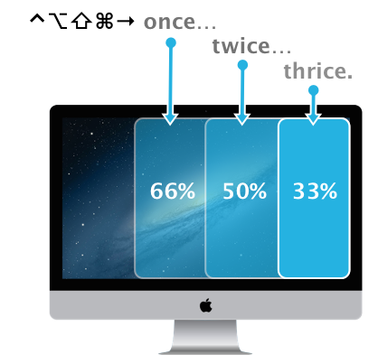

Cycle Window Sizes
==================

This [Keyboard Maestro](http://www.keyboardmaestro.com/main/) library includes macros to move the front most window to the left, center, or right of the screen. Instead of using a single size for each position, each macro will cycle between different window sizes when its keyboard shortcut is repeated, as seen below:

Download
==================

If you directly [download the library](https://github.com/gillibrand/keyboardmaestro-cycle-window-sizes/raw/master/Cycle%20Window%20Sizes.kmlibrary) it will treated as a text file. Just download it with the `.kmlibrary` extension (not `.txt`) to make it work.

Or, [download the zip](https://github.com/gillibrand/keyboardmaestro-cycle-window-sizes/archive/master.zip) and extract the library from that.

## Keyboard Shortcuts

    Move to Right Side      ⌥⌃⌘→
    Move to Left Side       ⌃⌥⌘←
    Move to Center          ⌃⌥⌘↓

## Customize It

To add, remove, or adjust the available window sizes see the `_Get WinSnapWidth` macro. The list of window sizes is stored in the `WinSnapSizes` variable.

## Known Problems

- Does not work well with more then one monitor. Windows are always moved to the main monitor even if multiple are attached. (Is there a way to get the _current_ screen in Keyboard Maestro?).

### Acknowledgments 

- Inspired by the Windows(!) app [Winsplit Revolution](http://winsplit-revolution.com). 
- Lovely iMac vector image from [IceflowStudios](http://www.iceflowstudios.com/2013/freebies/free-psd-2013-imac/).
